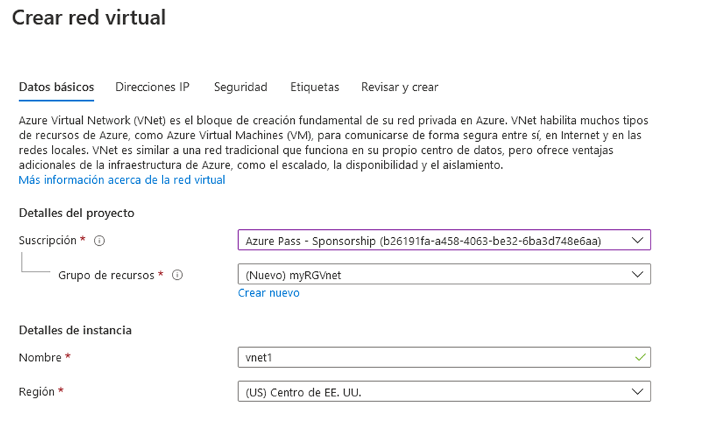
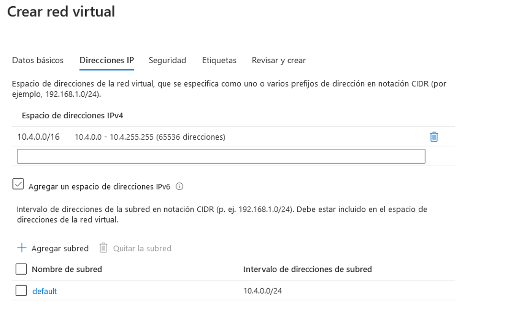
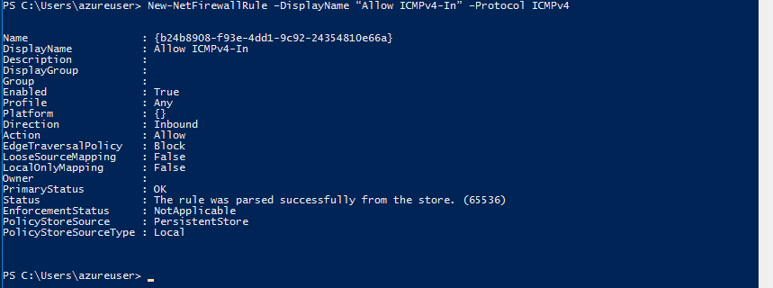

---
wts:
    title: '04 - Crear una red virtual (20 minutos)'
    module: 'Módulo 02: Servicios principales de Azure (Cargas de trabajo)'
---
# 04: Crear una red virtual

En este tutorial crearemos una red virtual, implementaremos dos máquinas virtuales en esa red virtual y luego las configuraremos para permitir que una máquina virtual haga ping a la otra dentro de esa red.

# Tarea 1: Crear una red virtual (20 minutos)

En esta tarea, crearemos una red virtual. 

1. Inicie sesión en Azure Portal en <a href="https://portal.azure.com" target="_blank"><span style="color: #0066cc;" color="#0066cc">https://portal.azure.com</span></a>

2. Desde la hoja **Todos los servicios**, busque y seleccione **Redes virtuales** y, luego, haga clic en **Agregar**. 

3. En la hoja **Crear red virtual** complete lo siguiente (deje los valores predeterminados para todo lo demás):

    | Configuración | Valor | 
    | --- | --- |
    | Nombre | **vnet1** |
    | Espacio de direcciones |**10.1.0.0/16** |
    | Suscripción | **Seleccione su suscripción** |
    | Grupo de recursos | **myRGVNet** (crear nuevo) |
    | Ubicación | **(EE. UU.) Este de EE. UU.** |
    | Subred - Nombre | **predeterminado** |
    | Rango de dirección de subred | **10.1.0.0/24** |

    
    

5. Haga clic en el botón **Revisar y crear**. Asegúrese de que la validación sea exitosa.

6. Haga clic en el botón **Crear** para implementar la red virtual. 

    **Nota**: En su organización, ¿cómo sabrá qué redes virtuales y direccionamiento IP necesitará?

# Tarea 2: Crear dos máquinas virtuales

En esta tarea crearemos dos máquinas virtuales en la red virtual. 

1. Desde la hoja **Todos los servicios**, busque **Maquinas virtuales** y luego haga clic en **Agregar**. 

2. En la pestaña **Datos básicos**, complete la siguiente información (deje los valores predeterminados para todo lo demás):

   | Configuración | Valor | 
   | --- | --- |
   | Suscripción | **Elija su suscripción**  |
   | Grupo de recursos |  **myRGVNet** |
   | Nombre de la máquina virtual | **vm1**|
   | Región | **(EE. UU.) Este de EE. UU.** |
   | Imagen | **Centro de datos de Windows Server 2019** |
   | Nombre de usuario| **azureuser** |
   | Contraseña| **Pa$$w0rd1234** |
   | Puertos de entrada públicos| Seleccione **Permitir puertos seleccionados**  |
   | Puertos de entrada seleccionados| **RDP (3389):** |
   |||

3. Seleccione la pestaña **Redes**. Asegúrese de que la máquina virtual esté ubicada en la red virtual vnet1. Revise la configuración predeterminada, pero no realice ningún otro cambio. 

   | Configuración | Valor | 
   | --- | --- |
   | Red virtual | **vnet1** |
   |||

4. Haga clic en **Revisar y crear**. Después de que la validación sea exitosa, haga clic en **Crear**. Los tiempos de implementación pueden variar, pero generalmente la implementación demora entre tres y seis minutos.

5. Supervise su implementación, pero continúe con el siguiente paso. 

6. Cree una segunda máquina virtual repitiendo los pasos anteriores del **2 al 4**. Asegúrese de usar un nombre de máquina virtual diferente, que la máquina virtual esté dentro de la misma red virtual y que esté usando una nueva dirección IP pública:

    | Configuración | Valor |
    | --- | --- |
    | Grupo de recursos | **myRGVNet** |
    | Nombre de la máquina virtual |  **vm2** |
    | Red virtual | **vnet1** |
    | IP pública | (nuevo) **vm2-ip** |
    |||

7. Espere a que se implementen ambas máquinas virtuales. 

# Tarea 3: Probar la conexión 

En esta tarea, permitiremos conexiones ICMP y probaremos si las máquinas virtuales pueden comunicarse (hacer ping) entre sí. 

1. Desde la hoja **Todos los recursos**, busque **vm1**, abra la pestaña **Visión general** y asegúrese de que su **Estado** sea **Ejecutándose**. Es posible que necesite **Actualizar** la página.

2. En la hoja **Información general**, haga clic en el botón **Conectar**.

    **Nota**: Las siguientes instrucciones le indican cómo conectarse a su VM desde un equipo con Windows. 

3. En la hoja **Conectar a la máquina virtual**, mantenga las opciones predeterminadas en conectarse por dirección IP a través del puerto 3389 y haga clic en **Descargar archivo RDP**.

4. Abra el archivo RDP descargado y haga clic en **Conectar** cuando se le solicite. 

5. En la ventana **Seguridad de Windows**, escriba el nombre de usuario **azureuser** y la contraseña **Pa$$w0rd1234** y luego haga clic en **Aceptar**.

6. Es posible que reciba una advertencia de certificado durante el proceso de inicio de sesión. Haga clic en **Sí** o cree la conexión y conéctese a su VM implementada. Debería conectarse correctamente.

7. Abra un símbolo del sistema de PowerShell en la máquina virtual haciendo clic en el botón **Inicio**, escribiendo **PowerShell**, haciendo clic con el botón derecho en **Windows PowerShell** en el menú del botón derecho y seleccionando **Ejecutar como administrador**.

8. Intente hacer ping a vm2 (asegúrese de que vm2 se esté ejecutando). Recibirá un error que indica que la solicitud ha excedido el tiempo de espera.  El `ping` falla porque usa el **Protocolo de mensajes de control de Internet (ICMP)**. De forma predeterminada, ICMP no está permitido a través del firewall de Windows.


   ```PowerShell
   ping vm2
   ```
   
   

    **Nota**: Ahora abrirá una sesión RDP en vm2 y permitirá conexiones entrantes ICMP

9. Conectar a **vm2** mediante RDP. Puede seguir los pasos **2 a 6**.

10. Abra un aviso de **PowerShell** y habilite ICMP. Este comando permite conexiones entrantes ICMP a través del firewall de Windows.

   ```PowerShell
   New-NetFirewallRule –DisplayName “Allow ICMPv4-In” –Protocol ICMPv4
   ```
   

   **Nota**: Ahora cambiará a la sesión RDP a vm1 e intentará hacer ping nuevamente.

11. Regrese a la sesión RDP a vm1 e intente hacer ping nuevamente. Ahora debería tener éxito. 

   ```PowerShell
   ping vm2
   ```

¡Enhorabuena! Ha configurado dos máquinas virtuales y las ha implementado en una red virtual. También ha configurado el firewall de Windows para que una de las máquinas virtuales permita las solicitudes de ping entrantes. 

**Nota**: Para evitar costes adicionales, puede quitar este grupo de recursos. Busque grupos de recursos, haga clic en su grupo de recursos y, a continuación, haga clic en **Eliminar grupo de recursos**. Compruebe el nombre del grupo de recursos y luego haga clic en **Eliminar**. Supervise las **Notificaciones** para ver cómo se realiza la eliminación.
